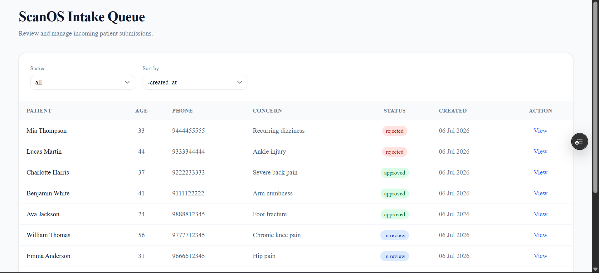
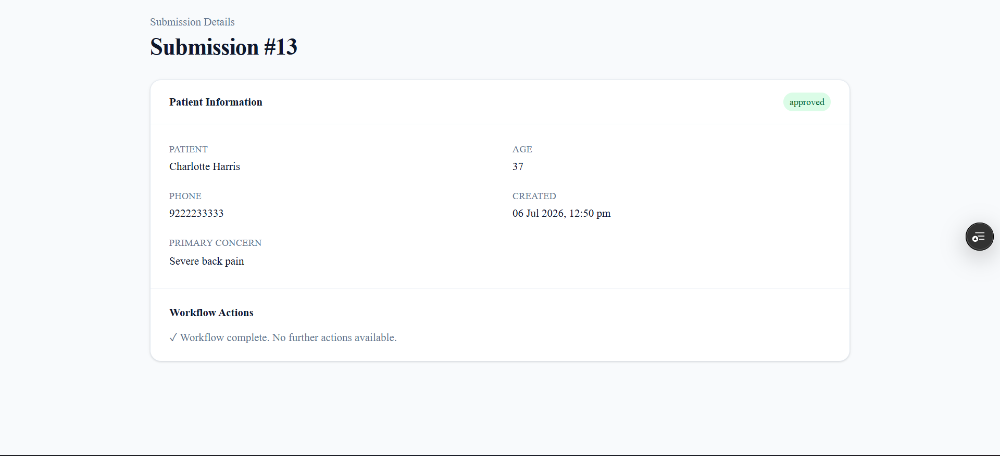

# ScanOS Intake Queue

A full-stack patient intake queue application built with Django REST Framework and Next.js. The application allows staff to browse patient intake submissions, review submission details, and manage the intake queue through filtering, sorting, and pagination.

The backend exposes a REST API with validated business rules, while the frontend provides a responsive interface for reviewing and managing patient submissions.

---

## Live Demo

| Resource | Link |
|----------|------|
| **Frontend** | https://scan-os.vercel.app |
| **Backend API** | https://scanos-backend.onrender.com/api/submissions/ |
| **Repository** | https://github.com/tusharSeervi/ScanOS |

---

## Features

### Backend

- REST API for patient intake submissions
- Paginated submission listing
- Retrieve individual submissions
- Filter submissions by status
- Sort submissions by supported fields
- Server-side pagination
- Business rule validation for status transitions
- Sample data seeding via a Django management command

### Frontend

- Intake queue dashboard
- Submission detail page
- Status badges
- Status filtering
- Server-side sorting
- Pagination
- Loading and error states
- Dynamic routing for submission details
- Workflow actions for submission status updates

---

## Tech Stack

### Backend

- Python
- Django
- Django REST Framework
- SQLite
- django-filter

### Frontend

- Next.js (App Router)
- React
- TypeScript
- Tailwind CSS
- TanStack React Query
- Axios
- shadcn/ui

---

## Project Structure

```text
backend/
├── submissions/
├── config/
├── manage.py
└── requirements.txt

frontend/
├── app/
├── components/
├── hooks/
├── services/
├── types/
├── lib/
└── package.json

docs/
├── queue-view.png
└── submission-detail.png
```

---

## Getting Started

### Prerequisites

- Python 3.11+
- Node.js 18+
- npm

---

### Backend Setup

```bash
cd backend

python -m venv .venv

# Windows
.venv\Scripts\activate

pip install -r requirements.txt
```

### Database Migration

```bash
python manage.py migrate
```

### Load Sample Data

```bash
python manage.py seed_submissions
```

### Run Backend

```bash
python manage.py runserver
```

Backend will be available at:

```text
http://127.0.0.1:8000/
```

---

### Frontend Setup

```bash
cd frontend

npm install
```

### Run Frontend

```bash
npm run dev
```

Frontend will be available at:

```text
http://localhost:3000
```

---

## API Endpoints

| Method | Route | Description |
|--------|-------|-------------|
| GET | `/api/submissions/` | Returns paginated submissions |
| GET | `/api/submissions/<id>/` | Returns a single submission |
| PATCH | `/api/submissions/<id>/` | Updates a submission status with transition validation |

---

## Filtering

The submission list supports the following query parameters:

| Parameter | Description |
|-----------|-------------|
| `status` | Filter submissions by status |
| `ordering` | Sort the results |
| `page` | Navigate paginated results |

Example:

```http
GET /api/submissions/?status=new&ordering=-created_at&page=2
```

---

## Ordering

Supported ordering fields:

- `created_at`
- `patient_name`
- `age`

Ascending:

```text
ordering=patient_name
```

Descending:

```text
ordering=-created_at
```

---

## Pagination

Submission listings return Django REST Framework's standard paginated response:

```json
{
  "count": 15,
  "next": "...",
  "previous": null,
  "results": []
}
```

---

## Status Workflow

Allowed submission status transitions:

```text
NEW
  │
  ▼
IN_REVIEW
 ├──────────────┐
 ▼              ▼
APPROVED    REJECTED
```

The backend enforces these transition rules through the service layer.

Invalid transitions return a validation error.

---

## Screenshots

### Queue View



The intake dashboard displays patient submissions with server-side filtering, sorting, pagination, and quick navigation to submission details.

---

### Submission Detail



The submission detail page displays patient information, workflow status, and available actions based on the current submission state.

---

## Engineering Decisions

### Service Layer

Business rules for submission status transitions are centralized in a dedicated service layer to keep views lightweight and ensure validation remains reusable.

### Generic Views

Django REST Framework generic views reduce boilerplate while keeping the API implementation clean and maintainable.

### React Query

TanStack React Query manages server state, request caching, loading states, and error handling for API interactions.

### Reusable Components

The frontend is organized into reusable UI components, including tables, filters, badges, and pagination controls.

### Dynamic Routing

Next.js App Router dynamic routes (`/submissions/[id]`) are used for submission detail pages.

---

## Future Improvements

- Search by patient name
- Optimistic UI updates
- Automated backend and frontend tests
- Authentication and authorization
- Docker support
- CI/CD pipeline

---

## Notes

- The frontend consumes the Django REST Framework API exposed by the backend.
- Sample submissions can be loaded using the provided Django management command.
- The backend independently validates submission status transitions to ensure data integrity regardless of the client.
